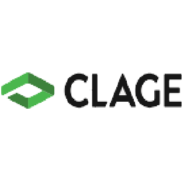

# ioBroker.clage-dsx

**Tests:** 

## clage-dsx adapter for ioBroker

connektion to clage dsx wather Heater

## Developer manual
This section is intended for the developer. It can be deleted later

### Getting started

For German https://github.com/TheBam1990/ioBroker.clage-dsx/blob/master/README_DE.md

API Doku: https://github.com/TheBam1990/ioBroker.clage-dsx/blob/master/CLAGE%20HomeServer%20API%20v1.3.4.pdf

Connekting infos JS: https://github.com/TheBam1990/ioBroker.clage-dsx/blob/master/connektion.md

Simply enter the IP address of your DSX server and enter your username and password.
Attention, all fields must be filled in otherwise it won't work.

The Setpoint value is the temperature with a value without commer (Temp / 10)

The FlowMax value, which ensures the flow in the device, can also be changed.
As well as a name can also be entered

## Changelog

### 0.0.1
* (TheBam) initial release

## License
MIT License

Copyright (c) 2021 TheBam <elektrobam@gmx.de>

Permission is hereby granted, free of charge, to any person obtaining a copy
of this software and associated documentation files (the "Software"), to deal
in the Software without restriction, including without limitation the rights
to use, copy, modify, merge, publish, distribute, sublicense, and/or sell
copies of the Software, and to permit persons to whom the Software is
furnished to do so, subject to the following conditions:

The above copyright notice and this permission notice shall be included in all
copies or substantial portions of the Software.

THE SOFTWARE IS PROVIDED "AS IS", WITHOUT WARRANTY OF ANY KIND, EXPRESS OR
IMPLIED, INCLUDING BUT NOT LIMITED TO THE WARRANTIES OF MERCHANTABILITY,
FITNESS FOR A PARTICULAR PURPOSE AND NONINFRINGEMENT. IN NO EVENT SHALL THE
AUTHORS OR COPYRIGHT HOLDERS BE LIABLE FOR ANY CLAIM, DAMAGES OR OTHER
LIABILITY, WHETHER IN AN ACTION OF CONTRACT, TORT OR OTHERWISE, ARISING FROM,
OUT OF OR IN CONNECTION WITH THE SOFTWARE OR THE USE OR OTHER DEALINGS IN THE
SOFTWARE.